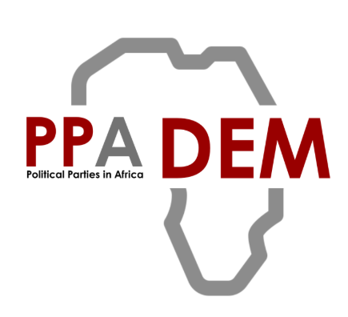
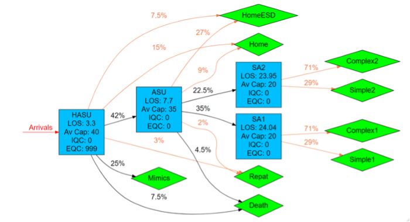
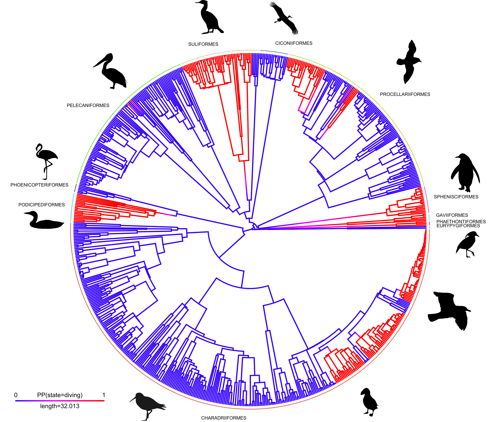
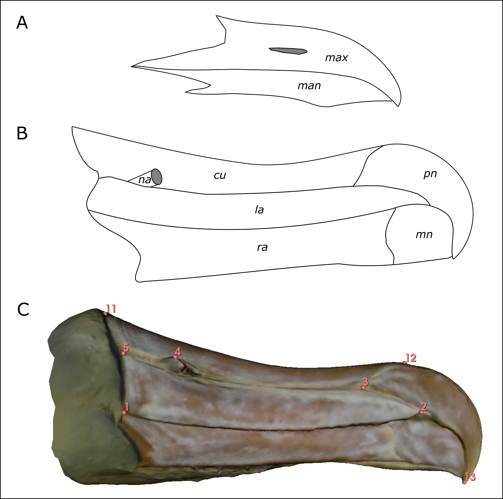

A selection of research software packages, data science tools, and quantitative projects I have developed or contributed to.

## Active Projects

 

<!-- digiqual -->
::: {.project-item #digiqual}
::: {.project-image-container}
{.project-image}
:::
::: {.project-body}
::: {.project-tags}
[Python]{.tag}
[RSE]{.tag}
[Statistics]{.tag}
[Product Design]{.tag}
[Stakeholder Engagement]{.tag}
:::
## digiqual

A Python library developed and maintained for the UNDT group in the School of Electrical, Electronic and Mechanical Engineering at the University of Bristol. It provides a framework for Non-Destructive Evaluation (NDE) reliability assessment, implementing the Generalised $\hat{a}$-versus-$a$ method to calculate probability of detection (PoD) curves.

**Key features:**

- Active learning workflows using bootstrap committees to identify regions of high model uncertainty.
- Latin Hypercube Sampling (LHS) for experimental design optimization.
- Support for multi-dimensional marginalization of stochastic parameters (e.g., surface roughness).

::: {.project-links}
[Documentation](https://jgibristol.github.io/digiqual/){.project-link-btn .primary}
[GitHub Repository](https://github.com/JGIBristol/digiqual){.project-link-btn}
:::
:::
:::

<!-- PPADEM -->
::: {.project-item #ppadem}
::: {.project-image-container}
{.project-image}
:::
::: {.project-body}
::: {.project-tags}
[Data Team Recruitment & Management]{.tag}
[Data Collection]{.tag}
[Modelling & Analysis]{.tag}
[Project Development]{.tag}
[Political Science]{.tag}
:::
## PPADEM

Data Science and Management support provided to the Political Parties in Africa DEMocracy (PPADEM) project at the School of Sociology, Politics and International Studies, University of Bristol, developing reproducible statistical workflows around digital political communications.

::: {.project-links}
[Project Website](https://politicalpartiesafrica.com/ppadem/){.project-link-btn .primary}
:::
:::
:::

## Past Projects

 

<!-- PathSimR -->
::: {.project-item #pathsimr}
::: {.project-image-container}
{.project-image}
:::
::: {.project-body}
::: {.project-tags}
[R / Shiny]{.tag}
[RSE]{.tag}
[Simulation]{.tag}
:::
## PathSimR

An R package and Shiny UI developed for modelling patient flow and pathway capacity in NHS organisations. It uses discrete event simulation (DES) and queueing theory to run "what-if" analyses, allowing managers to estimate waiting times and identify service bottlenecks.

::: {.project-links}
[GitHub Repository](https://github.com/nhs-bnssg-analytics/PathSimR){.project-link-btn .primary}
[Journal Article](https://doi.org/10.1080/17477778.2022.2081521){.project-link-btn}
:::
:::
:::

<!-- SPHERE-PPL -->
::: {.project-item #sphere-ppl}
::: {.project-image-container}
{.project-image}
:::
::: {.project-body}
::: {.project-tags}
[R / Stan]{.tag}
[Bayesian Stats]{.tag}
[Ecology]{.tag}
:::
## SPHERE-PPL Contests

Open-source forecasting contests, scoring tools, and training materials developed for the SPHERE-PPL project at the Alan Turing Institute. The work supported Bayesian Hierarchical and Phylogenetic Generalised Linear Mixed Models (PGLMMs) to predict biodiversity hotspots.

::: {.project-links}
[Project Website](https://sphere-ppl.org){.project-link-btn .primary}
:::
:::
:::

<!-- Diving -->
::: {.project-item #diving}
::: {.project-image-container}
{.project-image}
:::
::: {.project-body}
::: {.project-tags}
[R]{.tag}
[Evolutionary Biology]{.tag}
[Simulation]{.tag}
[Modelling]{.tag}
[Statistics]{.tag}
:::
## Evolution of Diving in Waterbirds

Macroevolutionary analysis investigating the repeated convergence of diving within Waterbirds. Uses phylogenetic comparative methods in R to model rates and directionality of evolution.

::: {.project-links}
[Proc B Publication](https://doi.org/10.1098/rspb.2022.2056){.project-link-btn .primary}
:::
:::
:::

<!-- Albatross -->
::: {.project-item #albatross}
::: {.project-image-container}
{.project-image}
:::
::: {.project-body}
::: {.project-tags}
[R]{.tag}
[Evolutionary Biology]{.tag}
[Morphometrics]{.tag}
:::
## Albatross Bill Shape

Quantitative morphometric analysis investigating the shape variation in the compound bills of albatrosses. Uses phylogenetic comparative methods in R to study bill shape adaptation relative to diet and feeding strategy.

::: {.project-links}
[RSOS Publication](https://doi.org/10.1098/rsos.230751){.project-link-btn .primary}
:::
:::
:::

<!-- Penguins -->
::: {.project-item #penguins}
::: {.project-image-container}
{.project-image}
:::
::: {.project-body}
::: {.project-tags}
[R]{.tag}
[Genetics]{.tag}
[Species Delimitation]{.tag}
:::
## Gentoo Penguin Species

Integrative species delimitation using genetic and morphometric datasets in R. This research demonstrated that the Gentoo Penguin is comprised of four distinct, morphologically and genetically isolated species.

::: {.project-links}
[Ecol Evol Publication](https://doi.org/10.1002/ece3.6973){.project-link-btn .primary}
[Conversation Article](https://theconversation.com/how-we-discovered-three-new-species-of-penguin-in-the-southern-ocean-149325){.project-link-btn}
:::
:::
:::
